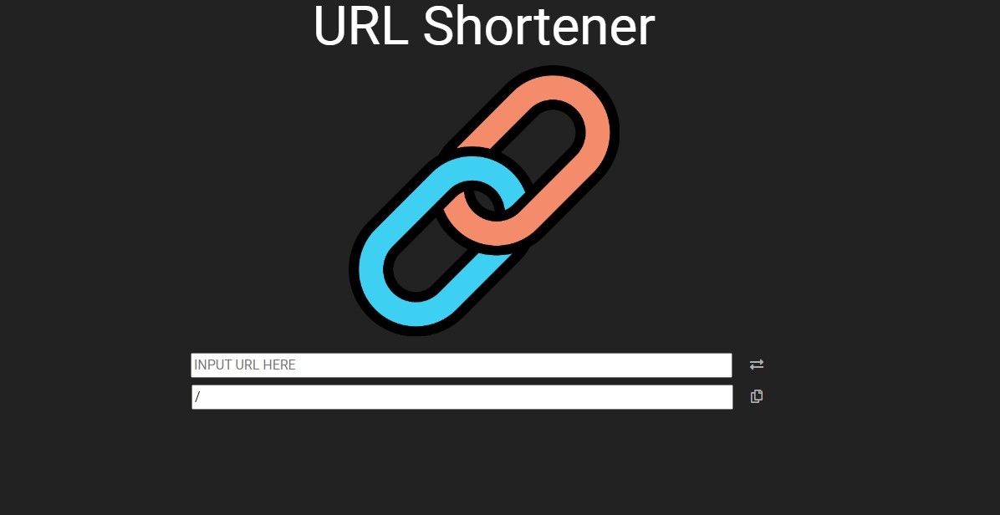

# S2-3_A11_短網址產生器
用來產生短網址的工具



 ## Features 產品功能
  * 使用者可以將網址丟進來轉成短網址並複製

 

# Getting Started

 ## Built With 環境與套件
  * Node.js
  * Nodemon
  * Express 4.17.1
  * express-handlebars 4.0.2
  * mongoose 5.9.7
 


 ## Installing 如何安裝
  ### 1.開啟終端機terminal，複製此專案至本地端
  ```
  git clone https://github.com/azragel/urlshortener.git
  ```

  ### 2.進入專案資料夾
  ```
  cd [專案資料夾]
  ```

  ### 3.安裝專案使用套件(會依package.json內容安裝)
  ```
  npm install 
  ```

  ### 4.安裝nodemon套件
  ```
  npm install nodemon
  ```
  
  ### 5.設定環境變數MONGODB_URI_xxx
  ```
  set "MONGODB_URI_SHORTEN=你的資料庫連接字串"
  ```

  ### 6.載入種子數據
  ```
  npm run seed
  ```

  ### 7.啟動伺服器
  ```
  npm run dev
  ```
  終端機顯示 http://localhost:3000 is activated 表示成功啟動
  終端機顯示url-shortener mongoDB connected! 表示資料庫連結成功

  ### 8.在瀏覽器上鍵入網址 http://localhost:3000/
  開始使用網站
  

# Authors 開發人員
[Robert Liu](https://github.com/azragel)

# Acknowledgments 感謝
Alpha Camp 


